# RunningMan

## 概要
プレイヤを操作してステージをクリアするゲーム

## ゲーム画面

  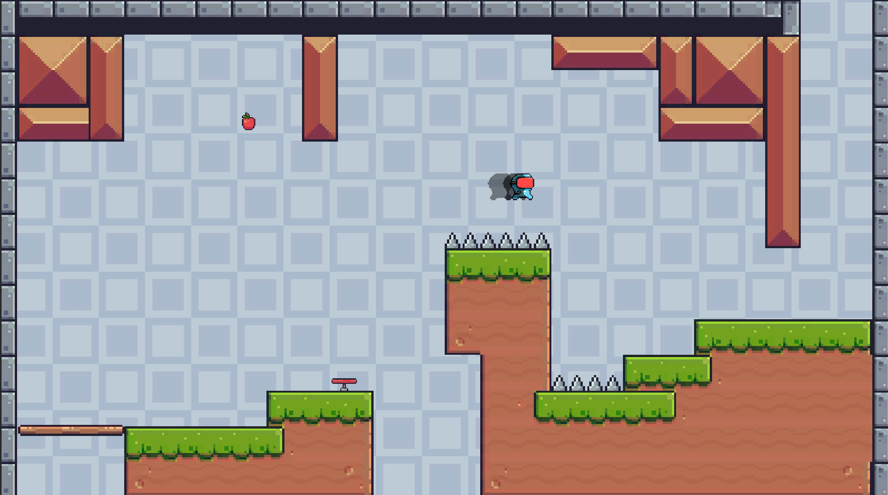
  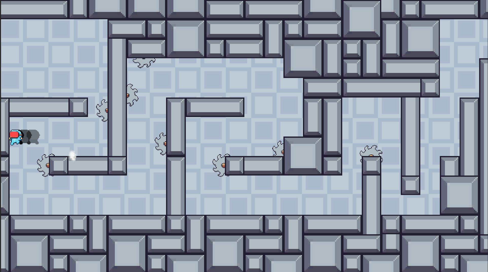
  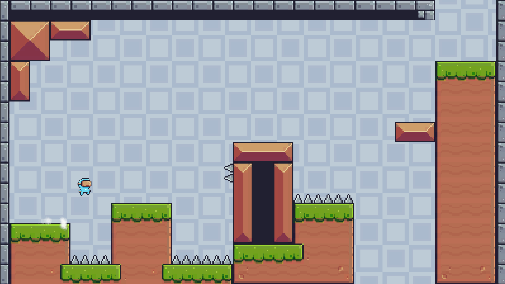
  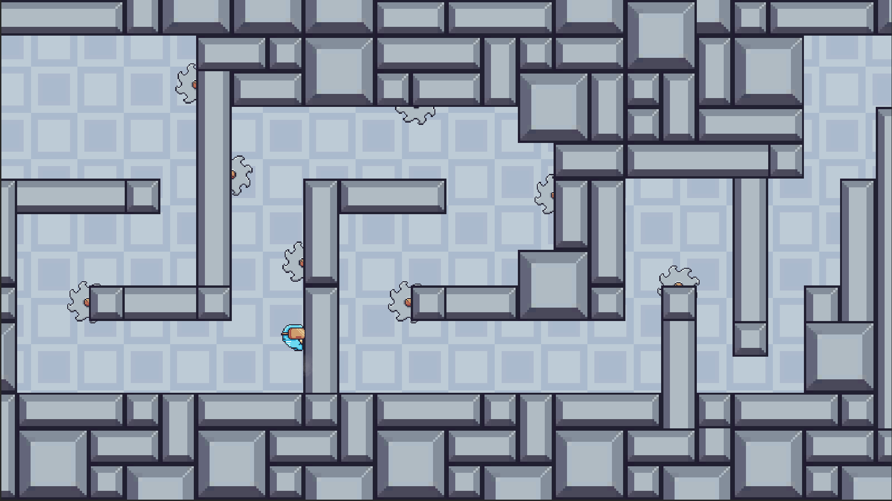

**ゲーム紹介動画**

## ゲーム実行ファイルのダウンロード

パッド(Xboxの方が望ましい)のみ対応しています

<a href="https://drive.google.com/file/d/1QiQSTChbh0g_XJugiJhidbmwY0Qy1RAP/view?usp=drive_link" target="_blank">ここをクリック</a>

## 技術紹介
#### 目次
- [キャラクター](#キャラクター)
- [ステージ](#ステージ)
- [オブジェクトプール](#オブジェクトプール)
- [タイルマップ](#タイルマップ)
- [インスペクター拡張](#インスペクター拡張)
- [その他](#その他)

---

### キャラクター
Playerはステートマシンを使って制御しています

パラメータが編集しやすくするためScriptableObjectを使って実行しながらパラメータ調整できます

  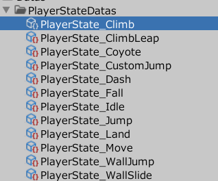
  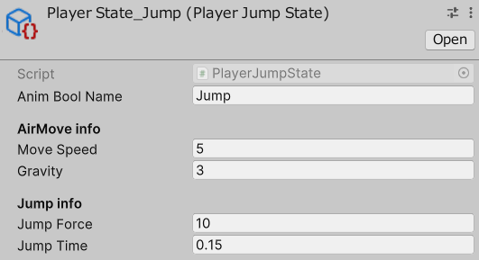

**ジャンプ入力バッファ** と **コヨテタイム**(プレイヤーがプラットフォームの端から少しはみ出しても一定時間ジャンプできる機能を指します)

  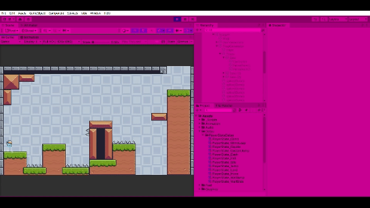
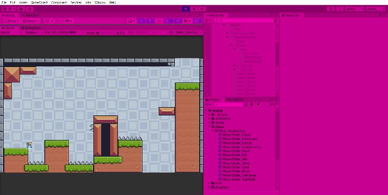

<a href = "https://github.com/Shatang0821/RunningUntiy/tree/main/Assets/_Scripts/Character/Player/PlayerStateMachine" target="_blank" rel="noopener noreferrer">詳細コード</a>

---

### ステージ
プレイヤの前後のステージだけ描画してパフォーマンスの最適化

  

    <strong style="color: blue;">エディタモードのステージ</strong>
    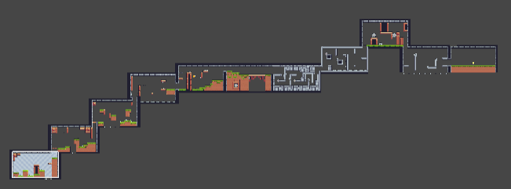
  

  

    <strong style="color: blue;">ゲームモードのステージ</strong>
    

      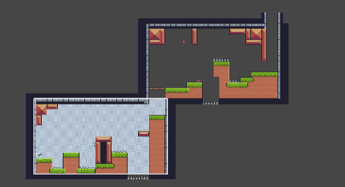
      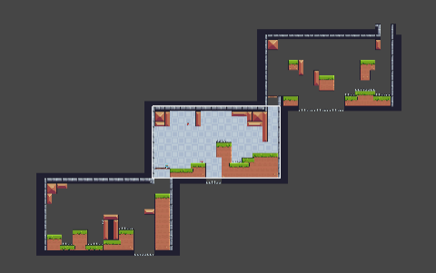
    

  

<a href = "https://github.com/Shatang0821/RunningUntiy/blob/main/Assets/_Scripts/SystemModules/StageManager.cs" target="_blank" rel="noopener noreferrer">詳細コード</a>

---

### オブジェクトプール
インスペクターで簡単に設定できる作り方です

      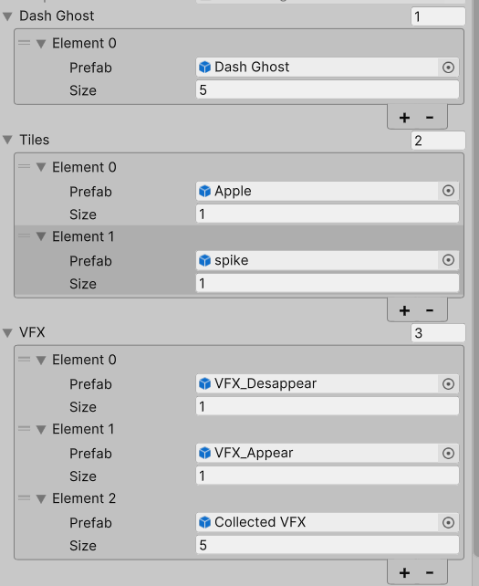

プレイヤがダッシュの際に生成した残像はオブジェクトプールを使って頻繁な生成と削除を防ぎます

      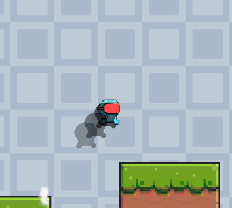
    

<a href = "https://github.com/Shatang0821/RunningUntiy/tree/main/Assets/_Scripts/Pool" target="_blank" rel="noopener noreferrer">詳細コード</a>

---

### タイルマップ
Unityのタイルマップを応用して、タイルを置くだけで静的なギミックの生成もしくはアイテムの生成ができます

  

      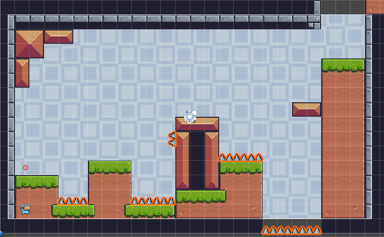
      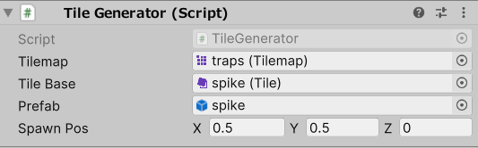
  

<a href = "https://github.com/Shatang0821/RunningUntiy/blob/main/Assets/_Scripts/Stage/Map/TileGenerator.cs" target="_blank" rel="noopener noreferrer">詳細コード</a>

---

### インスペクター拡張
レベルデザイナーがカッタートラップが配置しやすくするためインスペクター拡張しました

  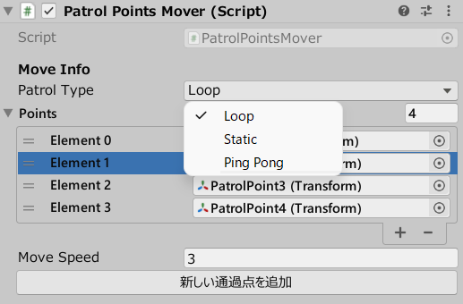

**新しい通過点を追加** をクリックすると自動でシーンに通過ポイントが生成されて、位置調整ができます

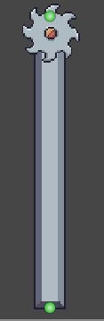

<a href = "https://github.com/Shatang0821/RunningUntiy/blob/main/Assets/_Scripts/Editor/CustomEdit/PatrolPointsEditor.cs" target="_blank" rel="noopener noreferrer">詳細コード</a>

---

### その他

  
イベント集中管理システム

  クラス間の結合度を避けるために使われるシステムとなります。

  文字列をキーとして使っています
  <a href = "https://github.com/Shatang0821/RunningUntiy/tree/main/Assets/_Scripts/SystemModules/EventCenter" target="_blank" rel="noopener noreferrer">詳細コード</a>

  
音マネージャークラス

  Audioクラスは音源と音量のデータを管理するクラスです。

  効果音を再生するなどの処理をまとめたクラスで、APIとして使用できます。

  <a href = "https://github.com/Shatang0821/RunningUntiy/blob/main/Assets/_Scripts/SystemModules/AudioManager.cs" target="_blank" rel="noopener noreferrer">詳細コード</a>

